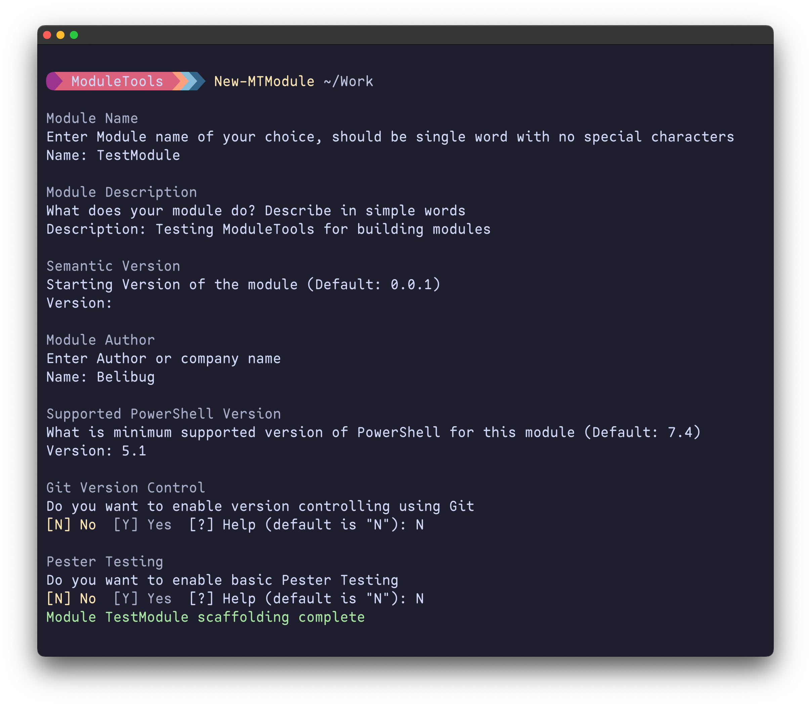

<div align="center" width="100%">
    <h1>ModuleTools</h1>
    <p>Fast, Versatile, standalone PowerShell module builder. Built for CICD and Automation.</p><p>
    <a target="_blank" href="https://github.com/belibug"></a>
    <a target="_blank" href="https://GitHub.com/belibug/ModuleTools/graphs/contributors/"></a><br>
    <a target="_blank" href="https://GitHub.com/belibug/ModuleTools/commits/"></a>
    <a target="_blank" href="https://GitHub.com/belibug/ModuleTools/issues/"></a>
    <a target="_blank" href="https://github.com/belibug/ModuleTools/issues?q=is%3Aissue+is%3Aclosed"></a><br>
</div>

## 💬 Description

Whether you're creating simple or robust modules, ModuleTools streamlines the process, making it perfect for CI/CD and automation environments. With comprehensive features included, you can start building PowerShell modules in less than 30 seconds. Let ModuleTools handle the build logic, so you can focus on developing the core functionality of your module.

[![ModuleTools@PowerShell Gallery][BadgeIOCount]][PSGalleryLink]
![WorkFlow Status][WorkFlowStatus]

The structure of the ModuleTools module is meticulously designed according to PowerShell best practices for module development. While some design decisions may seem unconventional, they are made to ensure that ModuleTools and the process of building modules remain straightforward and easy to manage.

> [!IMPORTANT]
> Checkout this [Blog article](https://blog.belibug.com/post/ps-modulebuild) explaining core concepts of ModuleTools.

## ⚙️ Install

```PowerShell
Install-Module -Name ModuleTools
```

> Note: ModuleTolls is still in early development phase and lot of changes are expected. Please read through [ChangeLog](/CHANGELOG.md) for all updates.

## 🧵 Design

To ensure this module works correctly, you need to maintain the folder structure and the `project.json` file path. The best way to get started is by running the `New-MTModule` command, which guides you through a series of questions and creates the necessary scaffolding.

## 📂 Folder Structure

All the Module files should be in inside `src` folder

```
 .
├──  project.json
├──  private
│  └──  New-PrivateFunction.ps1
├──  public
│  └──  New-PublicFunction.ps1
├──  resources
│  └──  some-config.json
└──  tests
   └──  Pester.Some.Tests.ps1
```

### Dist Folder

Generated module is stored in dist folder, you can easily import it or publish it to PowerShell repository. 

```
 dist
└──  TestModule
   ├──  TestModule.psd1
   └──  TestModule.psm1
```

### Project JSON File

The `project.json` file contains all the important details about your module and is used during the module build. It should comply with a specific schema. You can refer to the sample `project-sample.json` file in the `example` directory for guidance.

Run `New-MTModule` to generate the scaffolding; this will also create the `project.json` file.

### Src Folder

- Place all your functions in the `private` and `public` folders within the `src` directory.
- All functions in the `public` folder are exported during the module build.
- All functions in the `private` folder are accessible internally within the module but are not exposed outside the module.
- Contents of the `src/resources` folder, including any subfolder, will included in the `dist` folder during the module build.

#### resources Folder

The `resources` folder within the `src` directory is intended for including any additional resources required by your module. This can include files such as:

- **Configuration files**: Store any JSON, XML, or other configuration files needed by your module.
- **Script files**: Place any scripts that are used by your functions or modules, but are not directly part of the public or private functions.
- **Documentation files**: Include any supplementary documentation that supports the usage or development of the module.
- **Data files**: Store any data files that are used by your module, such as CSV or JSON files.
- **Subfolder**: Include any additional folders and their content to be included with the module, such as dependant Modules, APIs, DLLs, etc... organized by a subfolder.

When the module is built, the contents of the `src/resources` folder will be copied directly to the `dist` folder. If the `src/resources` folder contains any subfolders, those subfolders and their contents will also be included in the `dist` folder, ensuring that all necessary files are available for the module to function correctly.

How the resources folder gets copied to the "OutputModuleDir" folder will depends on the "ResourceCopyMode" project setting. When missing or set to "Folder", the resources folder will be copied. When "ResourceCopyMode" is set to "Content", then only the content of the resources folder will be copied.

Leave `src\resources` empty if there is no need to include any additional content in the `dist` folder.

An example of the module build where resources were included:

```powershell
dist
└── TestModule
        ├── TestModule.psd1
        ├── TestModule.psm1
        ├── config.json
        ├── additionalScript.ps1
        ├── helpDocumentation.md
        ├── sampleData.csv
        └── subfolder
            ├── subConfig.json
            ├── subScript.ps1
            └── subData.csv
```

### Tests Folder

If you want to run `pester` tests keep them in `tests` folder, if not you can ignore this function.

## 💻 Commands

### New-MTModule

This interactive command helps you create the module structure. Easily create the skeleton of your module and get started with module building in no time.

```powershell
## Create a module skeleton in Work Directory
New-MTModule ~/Work
```



### Invoke-MTBuild

`ModuleTools` is designed so that you don't need any additional tools like `make` or `psake` to run the build commands. There's no need to maintain complex `build.ps1` files or sample `.psd1` files. Simply follow the structure outlined above, and you can run `Invoke-MTBuild` to build the module. The output will be saved in the `dist` folder, ready for distribution.

The Invoke-MTBuild CmdLet includes a step where the resources folder and/or it's contents are copied to the "OutputModuleDir" folder. This is controlled by the optional "ResourceCopyMode" project setting.

If "ResourceCopyMode" = 'Folder or if it's missing, the entire resources folder gets copied to the "OutputModuleDir" folder.
If "ResourceCopyMode" = 'Content', only the content of the resources folder gets copied to the "OutputModuleDir" folder.

```powershell
# From the Module root 
Invoke-MTBuild

## Verbose for more details
Invoke-MTBuild -Verbose
```

### Get-MTProjectInfo

This functions give you complete info about the project which can be used in pester tests or for general troubleshooting.

### Invoke-MTTest

All the pester configurations are stored in `project.json`, simply run `Invoke-MTTest` command from project root, it will run all the tests inside `tests` folder

- To skip a test insdie test directory use `-skip` in describe/it/context block within Pester test.
- Use `Get-MTProjectInfo` command inside pester to get great amount of info about project and files

### Update-MTModuleVersion

A simple command to update the module version by modifying the values in `project.json`. You can also manually edit the file in your favorite editor. This command makes it easy to update the semantic version.

- Running `Update-MTModuleVersion` without any parameters will update the patch version (e.g., 1.0.1 -> 1.0.2).
- Running `Update-MTModuleVersion -Label Major` updates the major version (e.g., 1.0.1 -> 2.0.1).
- Running `Update-MTModuleVersion -Label Minor` updates the minor version (e.g., 1.0.1 -> 1.1.1).

## Advanced - Use it in Github Actions

This is not required for local module builds, if you are running github actions, use the following yaml workflow template to test, build and publish module which helps to automate the process of:

1. Checking out the repository code.
1. Installing the `ModuleTools` module from the PowerShell Gallery.
1. Building the module.
1. Running Pester tests.
1. Publishing the module to a specified repository.

This allows for seamless and automated management of your PowerShell module, ensuring consistency and reliability in your build, test, and release processes.

```yaml
name: Build, Test and Publish

on:
  push:
    branches:
      - main

jobs:
  build:
    runs-on: ubuntu-latest
    steps:
      - uses: actions/checkout@v4

      - name: Install ModuleTools module form PSGallery
        run: |
          Install-PSResource -Repository PSGallery -Name ModuleTools -TrustRepository
        shell: pwsh

      - name: Build Module
        run: Invoke-MTBuild -Verbose
        shell: pwsh

      - name: Run Pester Tests
        run: Invoke-MTTest
        shell: pwsh

      - name: Publish Package to Github
        run: |
          Publish-PSResource -Path ./dist/YourModule -Repository SomeRepository -ApiKey $Env:ApiKey
        env:
          ApiKey: ${{ secrets.API_KEY }}
        shell: pwsh
```

## 📝 Requirement

- Only tested on PowerShell 7.4, most likely wont work on 5.1
- No depenedencies. This module doesn’t depend on any other module.

## ✅ ToDo

- [ ] Support Classes and Enums in modules

## 🤝 Contributing

Contributions are welcome! Please fork the repository and submit a pull request with your changes. Ensure that your code adheres to the existing style and includes appropriate tests.

## 📃 License

This project is licensed under the MIT License. See the LICENSE file for details.

[BadgeIOCount]: https://img.shields.io/powershellgallery/dt/ModuleTools?label=ModuleTools%40PowerShell%20Gallery
[PSGalleryLink]: https://www.powershellgallery.com/packages/ModuleTools/
[WorkFlowStatus]: https://img.shields.io/github/actions/workflow/status/belibug/ModuleTools/Tests.yml
