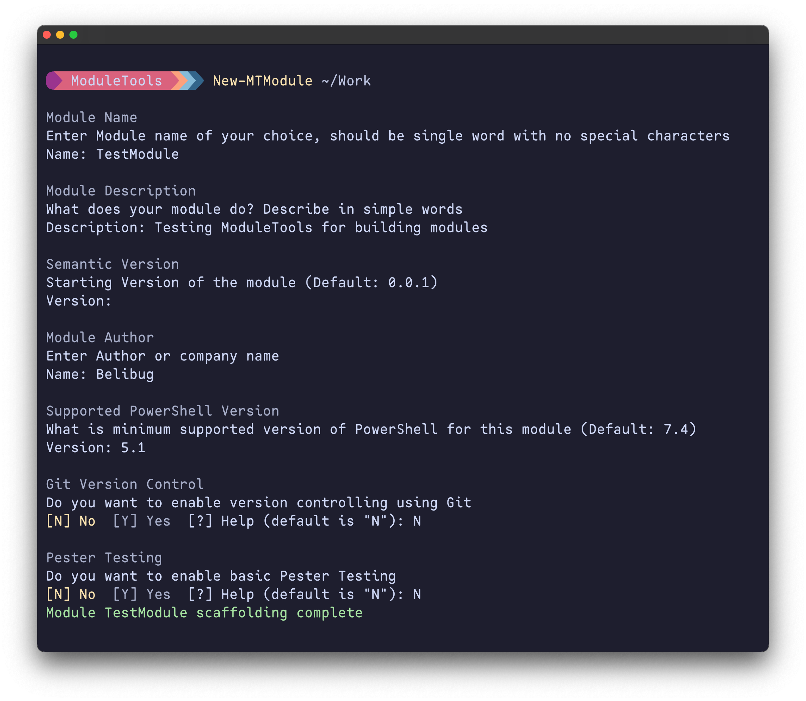

<div align="center" width="100%">
    <h1>ModuleTools</h1>
    <p>Fast, Versatile, standalone PowerShell module builder. Built for CICD and Automation.</p><p>
    <a target="_blank" href="https://github.com/belibug"></a>
    <a target="_blank" href="https://GitHub.com/belibug/ModuleTools/graphs/contributors/"></a><br>
    <a target="_blank" href="https://GitHub.com/belibug/ModuleTools/commits/"></a>
    <a target="_blank" href="https://GitHub.com/belibug/ModuleTools/issues/"></a>
    <a target="_blank" href="https://github.com/belibug/ModuleTools/issues?q=is%3Aissue+is%3Aclosed"></a><br>
</div>

## 💬 Description

Whether you're creating simple or robust modules, ModuleTools streamlines the process, making it perfect for CI/CD and automation environments. With comprehensive features included, you can start building PowerShell modules in less than 30 seconds. Let ModuleTools handle the build logic, so you can focus on developing the core functionality of your module.

[![ModuleTools@PowerShell Gallery][BadgeIOCount]][PSGalleryLink]
![WorkFlow Status][WorkFlowStatus]

The structure of the ModuleTools module is meticulously designed according to PowerShell best practices for module development. While some design decisions may seem unconventional, they are made to ensure that ModuleTools and the process of building modules remain straightforward and easy to manage.

> [!IMPORTANT]
> Check out this [blog article](https://blog.belibug.com/post/ps-modulebuild) explaining the core concepts of ModuleTools.

## ⚙️ Install

```PowerShell
Install-Module -Name ModuleTools
```

> Note: ModuleTools is still in an early development phase and lots of changes are expected. Please read through the [changelog](/CHANGELOG.md) for all updates.

## 🧵 Design

To ensure this module works correctly, you need to maintain the folder structure and the `project.json` file path. The best way to get started is by running the `New-MTModule` command, which guides you through a series of questions and creates the necessary scaffolding.

## 📂 Folder Structure

All module files should be inside the `src` folder.

```
 .
├──  project.json
├──  private
│  └──  New-PrivateFunction.ps1
├──  public
│  └──  New-PublicFunction.ps1
├──  resources
│  └──  some-config.json
└──  classes
   └──  Person.classes.ps1
   └──  Person.enums.ps1
```

### Dist Folder

The generated module is stored in the `dist` folder. You can easily import it or publish it to a PowerShell repository.

```
 dist
└──  TestModule
   ├──  TestModule.psd1
   └──  TestModule.psm1
```

### Docs Folder

Store `Microsoft.PowerShell.PlatyPS` generated Markdown files in the `docs` folder. If the `docs` folder exists and contains valid Markdown files, the build will generate a MAML help file in the built module.

```
 docs
├──  ModuleTools.md
└──  Invoke-MTBuild.md
```

### Project JSON File

The `project.json` file contains all the important details about your module and is used during the module build. It should comply with a specific schema. You can refer to the sample `project-sample.json` file in the `example` directory for guidance.

Run `New-MTModule` to generate the scaffolding; this will also create the `project.json` file.

#### Build settings (optional)

ModuleTools supports these optional settings at the top level of `project.json`:

- `BuildRecursiveFolders` (default: `false`)
  - When `true`, ModuleTools will discover `.ps1` files recursively in `src/classes` and `src/private`.
  - `src/public` is always **top-level only** (never recursive).
  - For `Invoke-MTTest`, `BuildRecursiveFolders=false` runs only top-level `tests/*.Tests.ps1` files (the usual Pester naming convention), while `BuildRecursiveFolders=true` also includes tests in subfolders.
- `FailOnDuplicateFunctionNames` (default: `false`, recommended: `true`)
  - When `true`, ModuleTools will parse the generated `dist/<Project>/<Project>.psm1` and fail the build if duplicate **top-level** function names exist.

Example:

```json
{
  "BuildRecursiveFolders": false,
  "FailOnDuplicateFunctionNames": true
}
```

### Src Folder

- Place all your functions in the `private` and `public` folders within the `src` directory.
- All functions in the `public` folder are exported during the module build.
- All functions in the `private` folder are accessible internally within the module but are not exposed outside the module.
- `src/classes` should contain classes and enums. These files are placed at the top of the generated `psm1`.
- `src/resources` content is handled based on `copyResourcesToModuleRoot`.

#### Deterministic processing order

To ensure builds are deterministic across platforms, files are processed in this order:

1. `src/classes`
2. `src/public`
3. `src/private`

Within each folder group, files are processed in a deterministic order by relative path (case-insensitive).

#### Recursive folder support

By default, ModuleTools loads only top-level `.ps1` files in each folder.

If `BuildRecursiveFolders` is set to `true`:

- `src/classes` and `src/private` are processed recursively.
- `src/public` remains top-level only.
- `Invoke-MTTest` also includes test files in nested folders under `tests`.

#### Resources Folder

The `resources` folder within the `src` directory is intended for including any additional resources required by your module. This can include files such as:

- **Configuration files**: Store any JSON, XML, or other configuration files needed by your module.
- **Script files**: Place any scripts that are used by your functions or modules, but are not directly part of the public or private functions.
- **formatdata files**: Store `Example.Format.ps1xml` file for custom format data types to be imported to manifest
- **types files**: Store `Example.Types.ps1xml` file for custom types data types to be imported to manifest
- **Documentation files**: Include any supplementary documentation that supports the usage or development of the module.
- **Data files**: Store any data files that are used by your module, such as CSV or JSON files.
- **Subfolder**: Include any additional folders and their content to be included with the module, such as dependant Modules, APIs, DLLs, etc... organized by a subfolder.


By default, resource files from `src/resources` go into `dist/resources`. To place them directly in dist (avoiding the resources subfolder), set `copyResourcesToModuleRoot` to `true`. This provides greater control in certain deployment scenarios where resources files are preferred in module root directory.

Leave `src\resources` empty if there is no need to include any additional content in the `dist` folder.

An example of the module build where resources were included and `copyResourcesToModuleRoot` is set to true.

```powershell
dist
└── TestModule
        ├── TestModule.psd1
        ├── TestModule.psm1
        ├── config.json
        ├── additionalScript.ps1
        ├── helpDocumentation.md
        ├── sampleData.csv
        └── subfolder
            ├── subConfig.json
            ├── subScript.ps1
            └── subData.csv
```

### Tests Folder

If you want to run Pester tests, keep them in the `tests` folder. Otherwise, you can ignore this feature.

## 💻 Commands

### New-MTModule

This interactive command helps you create the module structure. Easily create the skeleton of your module and get started with module building in no time.

```powershell
## Create a module skeleton in Work Directory
New-MTModule ~/Work
```



### Invoke-MTBuild

`ModuleTools` is designed so that you don't need any additional tools like `make` or `psake` to run the build commands. There's no need to maintain complex `build.ps1` files or sample `.psd1` files. Simply follow the structure outlined above, and you can run `Invoke-MTBuild` to build the module. The output will be saved in the `dist` folder, ready for distribution.

```powershell
# From the Module root 
Invoke-MTBuild

## Verbose for more details
Invoke-MTBuild -Verbose
```

### Get-MTProjectInfo

This function provides complete info about the project, which can be used in Pester tests or for general troubleshooting.

### Invoke-MTTest

All Pester configuration is stored in `project.json`. Run `Invoke-MTTest` from the project root; with `BuildRecursiveFolders=false` it runs only top-level `tests/*.Tests.ps1` files, matching Pester's normal test-file convention, and with `BuildRecursiveFolders=true` it also runs tests in nested folders under `tests`.

- To skip a test inside the test directory, use `-skip` in a `Describe`/`It`/`Context` block within the Pester test.
- Use `Get-MTProjectInfo` command inside pester to get great amount of info about project and files

### Update-MTModuleVersion

A simple command to update the module version by modifying the values in `project.json`. You can also manually edit the file in your favorite editor. This command makes it easy to update the semantic version.

- Running `Update-MTModuleVersion` without any parameters will update the patch version (e.g., 1.2.3 -> 1.2.4)
- Running `Update-MTModuleVersion -Label Major` updates the major version and resets Minor, Patch to 0 (e.g., 1.2.1 -> 2.0.0)
- Running `Update-MTModuleVersion -Label Minor` updates the minor version and resets Patch to 0 (e.g., 1.2.3 -> 1.3.0)

## Advanced - Use it in Github Actions

> [!TIP]
> This repository uses Github actions to run tests and publish to PowerShell Gallery, use it as reference.

This is not required for local module builds, if you are running github actions, use the following yaml workflow template to test, build and publish module which helps to automate the process of:

1. Checking out the repository code.
1. Installing the `ModuleTools` module from the PowerShell Gallery.
1. Building the module.
1. Running Pester tests.
1. Publishing the module to a specified repository.

This allows for seamless and automated management of your PowerShell module, ensuring consistency and reliability in your build, test, and release processes.

```yaml
name: Build, Test and Publish

on:
  push:
    branches:
      - main

jobs:
  build:
    runs-on: ubuntu-latest
    steps:
      - uses: actions/checkout@v4

      - name: Install ModuleTools module form PSGallery
        run: |
          Install-PSResource -Repository PSGallery -Name ModuleTools -TrustRepository
        shell: pwsh

      - name: Build Module
        run: Invoke-MTBuild -Verbose
        shell: pwsh

      - name: Run Pester Tests
        run: Invoke-MTTest
        shell: pwsh

      - name: Publish Package to Github
        run: |
          Publish-PSResource -Path ./dist/YourModule -Repository SomeRepository -ApiKey $Env:ApiKey
        env:
          ApiKey: ${{ secrets.API_KEY }}
        shell: pwsh
```

## 📝 Requirement

- Only tested on PowerShell 7.4, ~most likely~ will not work on 5.1. Underlying module can still support older version, only the ModuleTools builder wont work on older version.
- Only tested on PowerShell 7.4, so it most likely will not work on 5.1. The underlying module can still support older versions; only the ModuleTools builder won't work on older versions.
- No dependencies. This module doesn’t depend on any other module. Completely self-contained.

## ✅ ToDo

- [ ] Add more tests

## 🤝 Contributing

Contributions are welcome! Please fork the repository and submit a pull request with your changes. Ensure that your code adheres to the existing style and includes appropriate tests.

## 📃 License

This project is licensed under the MIT License. See the LICENSE file for details.

[BadgeIOCount]: https://img.shields.io/powershellgallery/dt/ModuleTools?label=ModuleTools%40PowerShell%20Gallery
[PSGalleryLink]: https://www.powershellgallery.com/packages/ModuleTools/
[WorkFlowStatus]: https://img.shields.io/github/actions/workflow/status/belibug/ModuleTools/Tests.yml